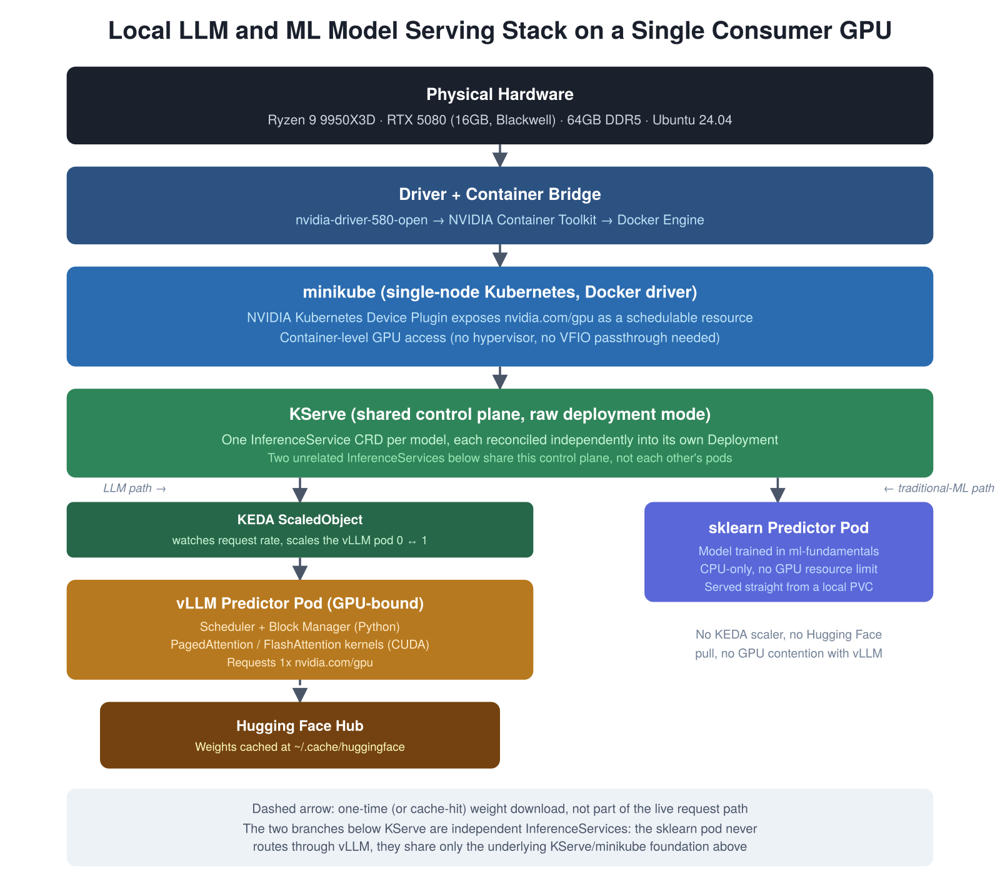
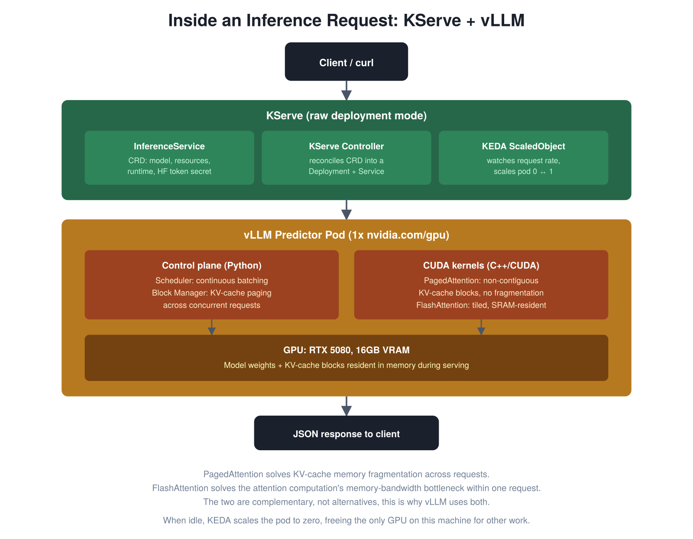
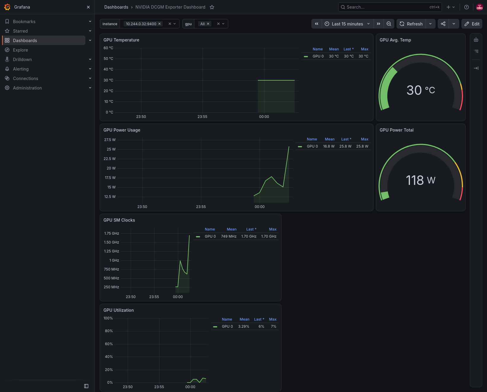
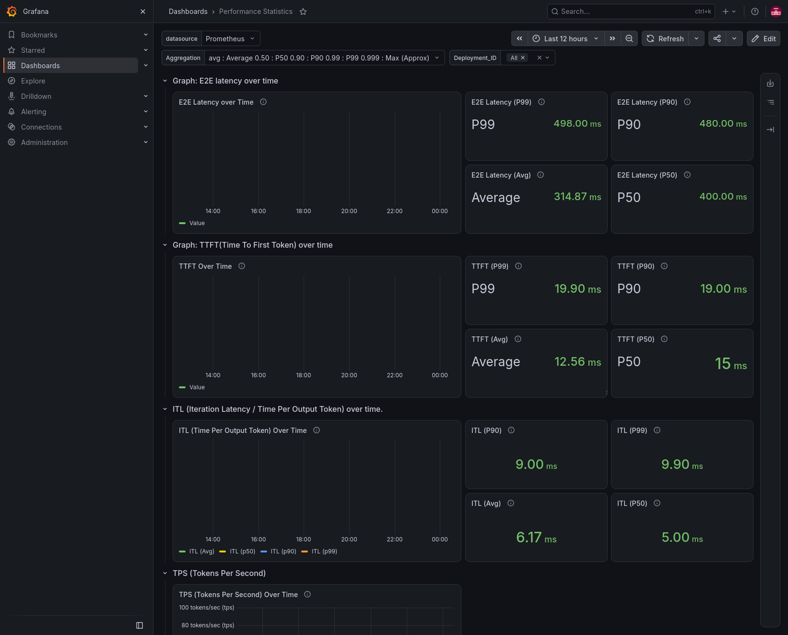
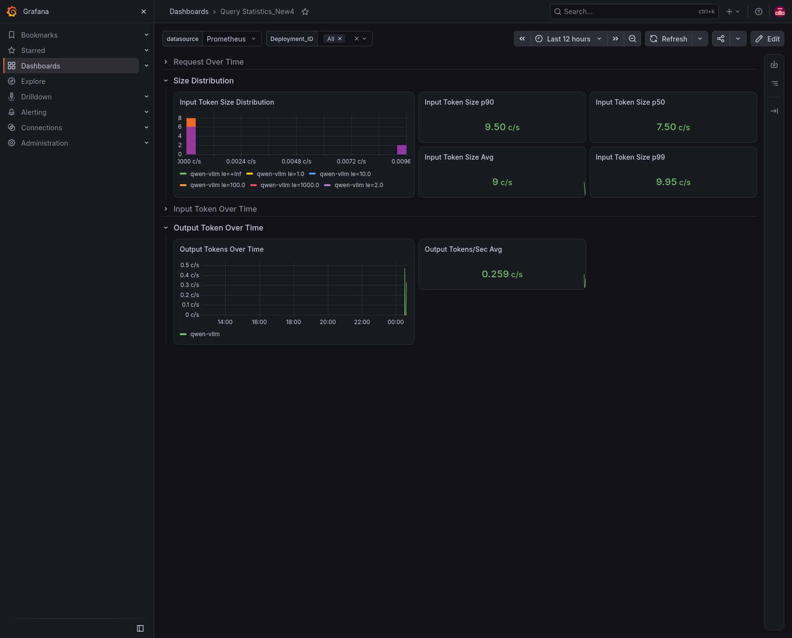

# Serving LLMs with KServe and vLLM on a Consumer GPU: A Local Kubernetes Build Log

*Part 2 of a series on building an AI/ML workstation from scratch. [Part 1](#) covered the hardware and OS layer: getting Ubuntu to recognize an RTX 5080 (Blackwell architecture required the open kernel module, not the standard NVIDIA driver), fixing a GDM/Wayland login corruption bug, and working around a dead onboard WiFi chip.*

This one picks up from there. The goal: deploy the same model-serving stack I use professionally, KServe on top of vLLM, on Kubernetes, but on a single consumer GPU instead of a cloud node pool. Along the way, I'll also add KEDA for scale-to-zero (not something you need in production with GPUs to spare, but genuinely useful when you only have one), and serve a traditional ML model through the same cluster, to show that KServe isn't only an LLM-serving tool.

I haven't found a written walkthrough that covers this specific combination end to end, which is part of why it's worth documenting properly, including the parts that break.

The full manifests, install scripts, and a running log of every issue hit along the way are in the companion repo: [local-model-serving-lab](#).



## Why this combination, and why it's harder than it looks

vLLM gives you the actual serving engine: PagedAttention for KV-cache memory management, continuous batching, and optimized CUDA kernels. KServe gives you the Kubernetes-native wrapper around it: InferenceService CRDs, standardized endpoints, and autoscaling. Most tutorials assume a datacenter GPU (A100, H100) and a managed Kubernetes cluster. None of that infrastructure assumption holds on a homelab machine with 16GB of VRAM and minikube.

## Prerequisites

- Workstation: Ryzen 9 9950X3D, RTX 5080 (16GB, Blackwell), 64GB DDR5, Ubuntu 24.04
- NVIDIA driver 580 (open variant), confirmed working via `nvidia-smi` (see Part 1)

Nothing else is installed yet at this point, so every layer below is built from scratch.

## Components and alternatives

| Layer | What I used | Alternatives | Why this choice |
|---|---|---|---|
| Container runtime | Docker | Podman, containerd directly | Most mature NVIDIA Container Toolkit integration and minikube support |
| Local Kubernetes | minikube | kind, k3s, MicroK8s | First-class `--gpus` support, easiest to debug when things break |
| GPU-to-container bridge | NVIDIA Container Toolkit | none realistic for NVIDIA GPUs | Required regardless of runtime choice |
| Model server | vLLM | TGI (Hugging Face's own), TensorRT-LLM (NVIDIA, more tuning effort, best raw throughput) | Best balance of ease-of-use and performance |
| Serving orchestration | KServe | Seldon Core, BentoML, raw Kubernetes Deployment + Service | CNCF-standard abstraction, industry default |
| Autoscaling | KEDA | Knative Serving (heavier: requires Istio/Kourier, 10GB+ RAM recommended), plain HPA (CPU/memory only, not request-aware) | Lightweight scale-to-zero without a service-mesh dependency |
| Model source | Hugging Face Hub | local weights, ModelScope | Native integration with vLLM |

## What "GPU passthrough" actually means here

Worth being precise about this term before using it. True GPU passthrough (PCI passthrough via VFIO) is a virtualization concept: a hypervisor hands a physical GPU directly to a guest VM, bypassing the host's own driver stack entirely, binding the device to `vfio-pci` instead of the host's `nvidia` driver. That's the mechanism behind, say, running a gaming VM with native GPU performance on a Linux host.

That's not what happens here. minikube with the Docker driver runs containers directly on the host Linux kernel, no VM boundary, no separate guest driver stack. The NVIDIA Container Toolkit exposes the host's own GPU device nodes and driver libraries into containers, and the Kubernetes device plugin extends that into pod scheduling. From a pod's point of view it looks like passthrough (it sees the GPU directly), but there's no hypervisor involved and no VFIO binding happening. This is simpler, has less overhead, and is the right choice for a single-machine homelab. VFIO only becomes relevant if you're running a VM-based Kubernetes driver (`--driver=kvm2`, for instance), where a real hypervisor boundary exists and the guest needs the device handed across it.

## Step 0: Install Docker

```bash
sudo apt update
sudo apt install ca-certificates curl gnupg
sudo install -m 0755 -d /etc/apt/keyrings
curl -fsSL https://download.docker.com/linux/ubuntu/gpg | sudo gpg --dearmor -o /etc/apt/keyrings/docker.gpg
echo \
  "deb [arch=$(dpkg --print-architecture) signed-by=/etc/apt/keyrings/docker.gpg] https://download.docker.com/linux/ubuntu \
  $(. /etc/os-release && echo "$VERSION_CODENAME") stable" | \
  sudo tee /etc/apt/sources.list.d/docker.list > /dev/null
sudo apt update
sudo apt install docker-ce docker-ce-cli containerd.io docker-buildx-plugin docker-compose-plugin
sudo usermod -aG docker $USER
```

Log out and back in for the group change to apply, then confirm:

```bash
docker run hello-world
```

> **If you see `permission denied while trying to connect to the docker API at unix:///var/run/docker.sock`:** this is expected if you run the `docker run` command in the same terminal session right after `usermod`, group membership is only read when a process is created, and your current shell was already running before the group change. Run `newgrp docker` to start a new shell with the updated group list picked up, without needing a full logout. Re-sourcing `~/.bashrc` will not fix this, that only re-runs shell configuration inside the existing process, it doesn't touch process credentials at all. `newgrp docker` (or a full logout/login) actually creates a new process, which is what makes the kernel re-check group membership.

## Step 1: Install the NVIDIA Container Toolkit

This is the bridge between the already-working `nvidia-driver-580-open` and Docker.

```bash
curl -fsSL https://nvidia.github.io/libnvidia-container/gpgkey | sudo gpg --dearmor -o /usr/share/keyrings/nvidia-container-toolkit-keyring.gpg
curl -s -L https://nvidia.github.io/libnvidia-container/stable/deb/nvidia-container-toolkit.list | \
  sed 's#deb https://#deb [signed-by=/usr/share/keyrings/nvidia-container-toolkit-keyring.gpg] https://#g' | \
  sudo tee /etc/apt/sources.list.d/nvidia-container-toolkit.list
sudo apt update
sudo apt install nvidia-container-toolkit
sudo nvidia-ctk runtime configure --runtime=docker
sudo systemctl restart docker
```

Verify GPU access from inside a container, this is the real checkpoint:

```bash
docker run --rm --gpus all nvidia/cuda:12.8.0-base-ubuntu24.04 nvidia-smi
```

> **On CUDA version and Blackwell:** the RTX 5080 is Blackwell architecture, compute capability `sm_120`, which CUDA only supports from **12.8** onward. Use 12.8 or later here, not an older tag. The Ubuntu version in the tag (`ubuntu24.04` here) is a different matter entirely, and doesn't need to match anything specific: a container ships its own complete userspace and shares only the host's kernel, so a container's OS tag doesn't need to match the host OS at all, an `ubuntu22.04` image runs fine on an `ubuntu24.04` host. Matching it here (to your actual Ubuntu 24.04) is just a readability choice, not a compatibility requirement, unlike the CUDA version, which is a real hardware-support constraint. Worth being aware of a subtlety though: `nvidia-smi` itself is a driver tool, not a CUDA-compiled program, so it talks to the host driver directly and would likely report the GPU correctly *even with an older CUDA image*. Passing this check is not proof the toolchain is Blackwell-ready, it only confirms the driver bridge works. The real test comes later, running an actual CUDA workload (vLLM, PyTorch) with kernels compiled for `sm_120`, that's where an outdated image or library produces the well-known `CUDA error: no kernel image is available for execution on the device`. Given how recently RTX 50-series support landed, it's also worth checking vLLM's current release notes for confirmed Blackwell support before pulling `vllm/vllm-openai:latest` in Step 4, some earlier tags require CUDA 12.9+ specifically and fail the same way on older ones; pin to a verified tag rather than trusting `latest` blindly.

## Step 2: Install kubectl, minikube, and Helm

```bash
curl -LO "https://dl.k8s.io/release/$(curl -L -s https://dl.k8s.io/release/stable.txt)/bin/linux/amd64/kubectl"
sudo install -o root -g root -m 0755 kubectl /usr/local/bin/kubectl

curl -LO https://storage.googleapis.com/minikube/releases/latest/minikube-linux-amd64
sudo install minikube-linux-amd64 /usr/local/bin/minikube

curl https://raw.githubusercontent.com/helm/helm/main/scripts/get-helm-3 | bash
```

## Step 3: Start minikube with GPU access

```bash
minikube start --driver=docker --container-runtime=docker --gpus=all

# NVIDIA's own docs now recommend Helm over the static manifest, use that:
helm repo add nvdp https://nvidia.github.io/k8s-device-plugin
helm repo update
helm upgrade -i nvdp nvdp/nvidia-device-plugin \
  --namespace nvidia-device-plugin \
  --create-namespace \
  --version 0.17.1
# Check `helm search repo nvdp` for the current version before running this

kubectl get node minikube -o jsonpath='{.status.allocatable.nvidia\.com/gpu}{"\n"}'
```

> **On this check:** it queries the GPU field directly and prints `1` if the device plugin has correctly registered the GPU with Kubernetes, with no ambiguity. If you'd rather see the full allocatable resource table for context, run `kubectl describe node minikube` with no filtering, resources are listed alphabetically there, so `nvidia.com/gpu` appears after `cpu`, `ephemeral-storage`, `hugepages-1Gi`, `hugepages-2Mi`, and `memory`, worth knowing if you ever pipe that output through something that only shows the first few lines.

> **A note on that static-manifest URL you may see elsewhere:** older guides (including an earlier draft of this one) point at `https://raw.githubusercontent.com/NVIDIA/k8s-device-plugin/main/nvidia-device-plugin.yml`, this now 404s. NVIDIA restructured the repo: the static YAML moved into a `deployments/static/` subfolder and is only published under versioned tags, not on `main`. The corrected static-manifest path, if you want that route instead of Helm, is `https://raw.githubusercontent.com/NVIDIA/k8s-device-plugin/v0.17.1/deployments/static/nvidia-device-plugin.yml`, but NVIDIA's own docs now call the static manifest a demo-only path and recommend Helm for anything beyond that, which is what's used above.

The command prints `1` if the GPU is correctly exposed. *(This is usually where things break the first time: driver/toolkit version mismatches between the host and the minikube-internal runtime are a known pain point. If it comes back empty, `docker exec -it minikube nvidia-smi` isolates whether the problem is host-to-node passthrough or the device plugin pod itself, and `kubectl get pods -n kube-system | grep -i nvidia` shows whether the device plugin pod is even running before you dig further.)*

## Step 4: Hugging Face integration

The Hugging Face CLI (now called `hf`, the old `huggingface-cli` name is deprecated) isn't installed by default, it comes from the `huggingface_hub` Python package, and a fresh Ubuntu install typically has neither `pip` nor the package itself yet:

```bash
sudo apt update
sudo apt install -y python3-pip
pip install -U huggingface_hub --break-system-packages
```

If the last command still says `pip: command not found` afterward, the binary was installed as `pip3` instead, use that:

```bash
pip3 install -U huggingface_hub --break-system-packages
```

The `--break-system-packages` flag is needed on Ubuntu 24.04: it ships Python as an "externally managed environment" (PEP 668), so a plain `pip install` refuses to run system-wide to avoid clashing with `apt`-managed packages, without the flag you'd get an `error: externally-managed-environment` message instead.

Then log in (the command is now `hf`, not `huggingface-cli`):

```bash
hf auth login
```

Accept the default ("Log in with your browser"), it prints a URL (`https://hf.co/oauth/device`) and a short code. Open that URL on any device, log in, enter the code, and approve. The CLI picks up the token automatically once you approve.

This stores a token at `~/.cache/huggingface/token`, needed for gated models and to raise download rate limits. Two things to handle deliberately:

- **Token propagation**: vLLM needs `HF_TOKEN` as an environment variable inside the container/pod, not just on the host.
- **Cache persistence**: without a mounted volume, every pod restart re-downloads the model. Mount `~/.cache/huggingface` so weights persist across restarts, including KEDA scale-to-zero cycles in Step 8.

Standalone vLLM test, before KServe enters the picture at all:

```bash
docker run --gpus all -p 8000:8000 \
  -e HF_TOKEN=$(cat ~/.cache/huggingface/token) \
  -v ~/.cache/huggingface:/root/.cache/huggingface \
  vllm/vllm-openai:latest \
  --model Qwen/Qwen2.5-7B-Instruct-AWQ \
  --quantization awq \
  --max-model-len 4096
```

> **On the model choice: this has to be a quantized checkpoint on a 16GB card, not a preference.** The full-precision `Qwen2.5-7B-Instruct` genuinely does not fit here: on this hardware, the RTX 5080 reported 15.45 GiB of usable VRAM (not the full 16GB nameplate, some is reserved by the driver), and the model's weights alone consumed 14.29 GiB on load, leaving under 1.2 GiB free. It crashed with a CUDA OOM error trying to allocate a 150 MiB sampler tensor, before vLLM even reached KV cache allocation. No `--gpu-memory-utilization` adjustment fixes this, the weights themselves already exceed a sane budget. The AWQ (4-bit) build above shrinks the checkpoint to roughly 5GB, leaving 10GB+ free for KV cache and activations. This is a genuine, worth-documenting constraint of running a 7B model on a 16GB consumer card, not a hypothetical.

Wait for the server to finish starting before testing anything. The line to watch for in the logs:

```
INFO:     Application startup complete.
```

Everything before that (weight loading, attention backend selection, CUDA graph capture) is still startup, not readiness.

Once you see it, a quick health check confirms the server is actually listening:

```bash
curl http://localhost:8000/health
```

An empty response with no error means it's up. Then send an actual completion request:

```bash
curl http://localhost:8000/v1/completions \
  -H "Content-Type: application/json" \
  -d '{"model": "Qwen/Qwen2.5-7B-Instruct-AWQ", "prompt": "Explain PagedAttention in one sentence.", "max_tokens": 50}'
```

You should get back a JSON response with the model's generated text. `curl` is the simplest way to test every endpoint in this guide going forward, the alternative (vLLM's auto-generated Swagger UI at `http://localhost:8000/docs`) pre-fills every possible field for each endpoint, which is accurate but a lot more clutter than a quick test needs.

Confirm this works before adding any Kubernetes layer on top. This isolates vLLM/CUDA/model-loading issues from anything KServe- or KEDA-specific.

**Stop the standalone container before moving on.** There's only one GPU on this machine, and the container is still holding its VRAM. Once KServe deploys its own vLLM pod in Step 6, it needs that memory free to load the model itself, leaving the standalone container running would mean both competing for the same 15.45 GiB, right back into OOM territory.

```bash
docker stop $(docker ps -q --filter ancestor=vllm/vllm-openai:latest)
```

Confirm the GPU is actually freed before continuing:

```bash
nvidia-smi
```

Memory usage should drop back down near idle.

## Step 5: Install KServe

KServe now has a real prerequisite that's easy to miss: **cert-manager**, which provisions the TLS certs KServe's admission webhooks need. Install and confirm it's running first:

```bash
kubectl apply -f https://github.com/cert-manager/cert-manager/releases/download/v1.21.2/cert-manager.yaml
kubectl wait --for=condition=ready pod -l app=cert-manager -n cert-manager --timeout=120s
kubectl get pods -n cert-manager
```

*(check cert-manager's current release tag before running this; KServe's minimum required version is 1.15.0)*

You should see three pods (`cert-manager`, `cert-manager-cainjector`, `cert-manager-webhook`) all `Running` before moving on.

The release manifest assumes the `kserve` namespace already exists rather than creating it, so create it first, then install KServe with `--server-side`, not a plain `apply`:

```bash
kubectl create namespace kserve
kubectl apply --server-side -f https://github.com/kserve/kserve/releases/download/v0.20.0/kserve.yaml
```

*(check the current release tag against KServe's docs before running this)*

> **Why `--server-side` matters here, and isn't optional:** a plain `kubectl apply` stores the entire applied object as a JSON annotation on the resource, for change-tracking. KServe's CRDs, particularly `InferenceService`, have grown large enough (with LLM-related fields added in recent versions) to exceed Kubernetes' 256KiB annotation size limit, which is exactly the `metadata.annotations: Too long` error. Server-side apply doesn't use that annotation mechanism at all, so it sidesteps the limit entirely, this is KServe's own documented fix, not a workaround.

> **If you'd already tried a plain `apply` once before switching to `--server-side`** (easy to have done, since that's the natural first thing to try), you'll likely hit `Apply failed with N conflicts: conflicts with "kubectl-client-side-apply"` on the webhook configurations. In theory `--force-conflicts` grants server-side apply permission to take ownership and resolves this. In practice, when the first attempt failed partway through creating dozens of resources, some fully created, some not, the resulting state is often messier than a single field-ownership conflict, and `--force-conflicts` alone may not be enough to reconcile it cleanly. The more reliable fix confirmed in testing: delete everything from the first attempt and reapply fresh, rather than trying to patch the partial state:
> ```bash
> kubectl delete -f https://github.com/kserve/kserve/releases/download/v0.20.0/kserve.yaml
> kubectl apply --server-side -f https://github.com/kserve/kserve/releases/download/v0.20.0/kserve.yaml
> ```
> `--force-conflicts` is worth trying first since it's non-destructive, but if conflicts persist, delete-and-reapply is the dependable path, not a last resort. If you still see `no matches for kind` errors on a clean apply, that's usually the CRDs not finished registering with the API server within that same call, a common race; re-running the exact same apply command once more is safe and typically resolves it.

**One more manifest is needed, and it's easy to miss:** `kserve.yaml` only installs the CRDs, controller, and webhooks, not the actual built-in model-serving runtimes (vLLM, sklearn, XGBoost, etc.). Those ship separately:

```bash
kubectl apply --server-side -f https://github.com/kserve/kserve/releases/download/v0.20.0/kserve-cluster-resources.yaml
kubectl get clusterservingruntimes
```

Without this, any `InferenceService` using the managed runtime pattern (like Step 9's sklearn model) fails with `No ServingRuntimes or ClusterServingRuntimes with the name: ...`, because none exist yet at all. The second command should list around a dozen runtimes (`kserve-vllmserver`, `kserve-sklearnserver`, `kserve-xgbserver`, and others), worth confirming this list is populated before moving on, even though Step 6's own vLLM manifest ends up bypassing this mechanism for reasons explained there.

> **A likely point of confusion worth heading off:** KServe's docs also describe a separate, newer CRD called `LLMInferenceService`, built for advanced multi-node generative AI serving (KV-cache-aware routing, prefill-decode separation, data/expert parallelism via LeaderWorkerSet, all Gateway-API-native). Its install requirements list Gateway API, the Gateway API Inference Extension, Envoy Gateway, and LeaderWorkerSet, real requirements, but only for that CRD. This guide uses the original, general-purpose `InferenceService` CRD instead, which needs only cert-manager. `LLMInferenceService`'s multi-node features solve the same problem `llm-d` does, distributing inference across several GPUs/nodes, and for the same reason `llm-d` was left out of this series (nothing to distribute on one GPU), none of that infrastructure is needed here either.

On minikube without Knative/Istio, raw deployment mode is the practical starting point. This is a deliberate simplification, not a minikube limitation: Knative can run on minikube, but it requires a service mesh (Istio or the lighter Kourier) underneath it and at least 10GB of RAM and 6 CPUs recommended, real setup cost for a homelab. Raw deployment mode skips that dependency entirely, which is also what makes KEDA (Step 8) the better fit here.

**This needs an explicit config change, KServe doesn't infer it automatically.** KServe's default deployment mode is `Serverless` (Knative-based) regardless of whether Knative is actually installed, so without this step, any `InferenceService` you create later will sit stuck in `Unknown` status with a `ServerlessModeRejected` event, since it's trying to use Knative Services that don't exist on this cluster. Switch the default before creating any InferenceService:

```bash
kubectl patch configmap/inferenceservice-config -n kserve --type=strategic \
  -p '{"data": {"deploy": "{\"defaultDeploymentMode\": \"RawDeployment\"}"}}'

kubectl rollout restart deployment kserve-controller-manager -n kserve
kubectl rollout status deployment kserve-controller-manager -n kserve
```

The rollout restart matters: the controller caches this config on startup, a `kubectl patch` alone doesn't reliably force it to notice the change immediately.

## Step 6: Define the InferenceService

This uses a **custom container spec** (`predictor.containers`) rather than the managed `predictor.model` + `ClusterServingRuntime` pattern, and that's a deliberate choice worth explaining before the YAML, since the managed pattern is what most KServe examples show first.

> **Why not the managed runtime:** the built-in `kserve-vllmserver` runtime (confirmed by testing) pins the image `vllm/vllm-openai:v0.20.0` with a hardcoded `command: [python, -m, vllm.entrypoints.openai.api_server]`, but that image tag has no plain `python` binary on `PATH`, only `python3`, so the pod crash-loops with `exec: "python": executable file not found in $PATH`. The managed runtime also auto-injects `--model=/mnt/models`, assuming the model arrives via KServe's own storage-initializer and a `storageUri`, which collides with this guide's approach of pulling from Hugging Face directly via `HF_TOKEN`. Specifying the container directly sidesteps both problems, and lets this manifest use the exact same image and args already validated in the Step 4 standalone `docker run` test, rather than trusting a managed template's assumptions.

This is `manifests/vllm-inferenceservice.yaml` in the repo:

```yaml
apiVersion: serving.kserve.io/v1beta1
kind: InferenceService
metadata:
  name: qwen-vllm
  annotations:
    serving.kserve.io/autoscalerClass: "external"
spec:
  predictor:
    containers:
      - name: kserve-container
        image: vllm/vllm-openai:latest
        args:
          - --port=8080
          - --served-model-name=qwen-vllm
          - --model=Qwen/Qwen2.5-7B-Instruct-AWQ
          - --quantization=awq
          - --max-model-len=4096
        ports:
          - containerPort: 8080
            protocol: TCP
        resources:
          requests:
            cpu: "2"
            memory: 4Gi
          limits:
            cpu: "4"
            memory: 12Gi
            nvidia.com/gpu: "1"
        env:
          - name: HF_TOKEN
            valueFrom:
              secretKeyRef:
                name: hf-token-secret
                key: token
```

`name: kserve-container` is required, KServe looks for a container with exactly that name to know which one is the actual model server when using this custom pattern. The `autoscalerClass: "external"` annotation is needed for KEDA in Step 8, explained there, it has no effect on anything in this step.

> **On the explicit `memory`/`cpu` resources: also not optional, confirmed by testing.** Leaving these unset lets KServe's webhook inject its own default resource limit for any container named `kserve-container`, even in this custom-containers pattern: confirmed at exactly `cpu: 1` / `memory: 2Gi` for both requests and limits, the same default seen earlier on the managed-runtime pod in Step 5's troubleshooting. That's far too small for this workload, and the pod was `OOMKilled`, a **host RAM** limit, distinct from the GPU VRAM issue in Step 4: this is tokenizer overhead, CUDA graph capture bookkeeping, and multiprocessing engine-core memory, not the AWQ checkpoint's own size. An `8Gi` limit got the pod running, but the logs showed only `1.71 GiB` free at that point (a `5.19 GiB` checkpoint plus baseline overhead leaves a tight margin), comfortable for one request at a time but thin under any concurrent load, so `12Gi` here builds in real headroom rather than the bare minimum, costless given 64GB of host RAM to spare.

Create the secret first rather than hardcoding the token:

```bash
kubectl create secret generic hf-token-secret --from-literal=token=$(cat ~/.cache/huggingface/token)
kubectl apply -f manifests/vllm-inferenceservice.yaml
kubectl get inferenceservice qwen-vllm
```

> **If `READY` shows `Unknown` and stays there:** check `kubectl get events` for `ServerlessModeRejected`. That means the deployment mode patch from Step 5 either wasn't applied yet or the controller hadn't picked it up before this InferenceService was created. Apply the patch (if you haven't), restart the controller, then delete and recreate this InferenceService so it reconciles fresh rather than waiting on the stuck one:
> ```bash
> kubectl delete inferenceservice qwen-vllm
> kubectl apply -f manifests/vllm-inferenceservice.yaml
> ```

Test the endpoint. This guide deliberately has no ingress controller installed (that's the whole point of raw deployment mode, see Step 5), so `kubectl port-forward` is the simplest way to reach the service, no NodePort, no `minikube ip`, no ingress needed:

```bash
kubectl get svc
```

Find the predictor's service (`qwen-vllm-predictor`), then:

```bash
kubectl port-forward svc/qwen-vllm-predictor 8080:80
```

Leave that running in one terminal (adjust the `80` if `kubectl get svc` shows a different port for that service), then from another terminal:

```bash
curl -v http://localhost:8080/v1/completions \
  -H "Content-Type: application/json" \
  -d '{"model": "qwen-vllm", "prompt": "Explain PagedAttention in one sentence.", "max_tokens": 50}'
```



## Step 7: Observability infrastructure, Prometheus and DCGM

Installing this now, before KEDA, rather than later as an afterthought: KEDA's original design in this guide used a Prometheus-based trigger, which meant Prometheus had to exist before KEDA could be wired up at all. That's no longer strictly true (Step 8 now uses the HTTP Add-on instead), but the monitoring stack is still worth setting up here as its own dedicated step, cleanly separated from KEDA's own concerns, rather than splitting installation commands for the same subsystem across two steps.

Install kube-prometheus-stack (Prometheus + Grafana):

```bash
helm repo add prometheus-community https://prometheus-community.github.io/helm-charts
helm repo update
helm install monitoring prometheus-community/kube-prometheus-stack \
  --namespace monitoring --create-namespace \
  --set prometheus.prometheusSpec.serviceMonitorSelectorNilUsesHelmValues=false
```

> **On that last flag, baked in from the start here rather than patched later:** kube-prometheus-stack's Prometheus, by default, only scrapes `ServiceMonitor` objects carrying a label matching its own Helm release name (`release: monitoring`). A `ServiceMonitor` created by a completely different chart, DCGM-exporter's below, or your own hand-written one, doesn't carry that label and gets silently ignored, no error, every Grafana panel just shows "No data." This flag opens Prometheus to watch all `ServiceMonitor`s cluster-wide regardless of label, confirmed by testing to be the actual fix for exactly this symptom.

Install the NVIDIA DCGM exporter (GPU hardware metrics):

```bash
helm repo add nvidia https://nvidia.github.io/dcgm-exporter/helm-charts
helm install dcgm-exporter nvidia/dcgm-exporter --namespace monitoring \
  --set serviceMonitor.additionalLabels.release=monitoring
```

*(verify the current chart repo/name and this exact values field at https://github.com/NVIDIA/dcgm-exporter before running, chart packaging has moved before)*

The `additionalLabels.release=monitoring` flag is DCGM's own chart-native way to satisfy the label Prometheus looks for, redundant with the selector flag above in this setup, but worth setting anyway: it's the officially documented approach (NVIDIA's own docs point to `serviceMonitor.additionalLabels` for exactly this), and defense in depth here costs nothing.

Wire vLLM's own `/metrics` endpoint in too, this is `manifests/vllm-servicemonitor.yaml` in the repo (the full breakdown of what's inside it, including three separate label/namespace/port mismatches confirmed by testing, is in Step 10):

```bash
kubectl apply -f manifests/vllm-servicemonitor.yaml
```

## Step 8: Add KEDA for real scale-to-zero, including waking back up

With one GPU on the whole machine, an idle vLLM pod is a GPU you can't use for anything else. KEDA can scale the predictor to zero without pulling in a service mesh. But scaling to zero is only half the story, and it's worth being upfront about the half that doesn't work by default, confirmed directly against KServe's own docs: *"Scale from Zero is currently not supported in Standard mode for HTTP requests."* A plain KEDA `ScaledObject` can take the replica count to zero, but nothing then wakes it back up when a request arrives, there's no pod, so a `curl` or `port-forward` just hits a dead end and sits there. Knative solves this with a component called an "activator" that always stays running and holds requests during cold start; raw/Standard KServe mode plus plain KEDA has no equivalent.

Install KEDA:

```bash
helm repo add kedacore https://kedacore.github.io/charts
helm repo update
helm install keda kedacore/keda --namespace keda --create-namespace
```

> **Before applying anything else: KServe creates its own HPA by default, and it will conflict.** In raw/Standard deployment mode, KServe automatically creates a Kubernetes `HorizontalPodAutoscaler` for the predictor Deployment, whether or not you intend to use KEDA. Applying a `ScaledObject` against a Deployment an HPA already manages gets rejected outright by KEDA's own admission webhook: `admission webhook "vscaledobject.kb.io" denied the request: the workload '...' is already managed by the hpa '...'`, a correct rejection, not a bug, since two autoscalers driving the same replica count would genuinely conflict. The fix, confirmed against KServe's own docs for this exact combination, is the `serving.kserve.io/autoscalerClass: "external"` annotation already added to the InferenceService in Step 6: it tells KServe to create neither its own HPA nor a KServe-managed KEDA object, handing scaling fully to the standalone `ScaledObject` below. If you already applied Step 6's manifest before this annotation was added, reapply it now (`kubectl apply -f manifests/vllm-inferenceservice.yaml`) so the existing HPA gets removed before continuing.

**The actual fix for wake-on-request: KEDA's HTTP Add-on.** This is a separate component, an "interceptor" that sits in front of the real Service, holds incoming requests while there's no ready pod, triggers the scale-up, and forwards the request once a pod is ready, the direct non-Knative equivalent of an activator. Install it:

```bash
helm install http-add-on kedacore/keda-add-ons-http --namespace keda
kubectl get pods -n keda | grep interceptor
```

One manifest drives this, an `HTTPScaledObject`. This is `manifests/vllm-http-scaledobject.yaml` in the repo:

```yaml
apiVersion: http.keda.sh/v1alpha1
kind: HTTPScaledObject
metadata:
  name: qwen-vllm-httpscaledobject
spec:
  hosts:
    - qwen-vllm.local
  scaleTargetRef:
    name: qwen-vllm-predictor
    kind: Deployment
    apiVersion: apps/v1
    service: qwen-vllm-predictor
    port: 80
  replicas:
    min: 0
    max: 1
  scalingMetric:
    requestRate:
      targetValue: 5
      window: 1m
      granularity: 1s
```

```bash
kubectl apply -f manifests/vllm-http-scaledobject.yaml
kubectl get scaledobject
```

> **Why `HTTPScaledObject`, not a hand-written `InterceptorRoute` + standalone `ScaledObject`.** Both APIs exist in this chart, and the newer `InterceptorRoute` (`http.keda.sh/v1beta1`) is documented as the current, non-deprecated one. But confirmed by testing: the actual external-scaler binary shipped with this chart version only resolves `GetMetricSpec` for a `ScaledObject` it generated itself from an `HTTPScaledObject`, it links them via a `Http Scaled Object` field baked into the trigger metadata at creation. A hand-written `ScaledObject` with just a `scalerAddress` and no such link fails with `unable to get the linked HTTPScaledObject for ScaledObject`, and never reports a metric, so nothing ever scales up, a real version-skew between the newer docs and the currently-shipping scaler component, not a mistake in the YAML itself. Apply only the `HTTPScaledObject` above; its own operator creates and owns the underlying `ScaledObject` for you, don't write one by hand.

> **A Prometheus-based trigger is a different, complementary tool, not a substitute for this.** An earlier draft of this guide used a `ScaledObject` with a `type: prometheus` trigger, which can genuinely take a replica count from zero to one on its own... but only by continuously polling a metric, and with no pod running there's nothing to scrape and nothing to poll, so it could scale down but never back up. It remains a good pattern for scaling instances 1→N based on custom load once something is already running (Step 10's `vllm:num_requests_waiting`, for instance), just not for the 0→1 wake-up problem this step solves. Prometheus and vLLM's `ServiceMonitor`, installed back in Step 7, aren't required for anything in this step anymore.

**Testing this requires going through the interceptor, not the predictor's own Service directly**, that's the whole point, the interceptor is what's actually watching for requests and holding them during cold start:

```bash
kubectl get svc -n keda | grep interceptor
```

Confirm the actual Service name from that output (chart versions vary slightly), then:

```bash
kubectl port-forward svc/keda-add-ons-http-interceptor-proxy 8080:8080 -n keda
```

In another terminal, note the `Host` header matching the `HTTPScaledObject`'s configured host:

```bash
curl -v http://localhost:8080/v1/completions \
  -H "Host: qwen-vllm.local" \
  -H "Content-Type: application/json" \
  -d '{"model": "qwen-vllm", "prompt": "Explain PagedAttention in one sentence.", "max_tokens": 50}'
```

> **If the request hangs indefinitely with no scale-up ever happening: check for a stale route.** The interceptor exposes a live queue at its admin port (`kubectl port-forward svc/keda-add-ons-http-interceptor-admin 9090:9090 -n keda`, then `curl http://localhost:9090/queue`), which shows exactly what it's holding requests against, by name. Confirmed by testing: a leftover, no-longer-scaled route from an earlier configuration attempt can silently keep absorbing requests (`{"Concurrency":1,"RequestCount":1}` against a dead route, `{"Concurrency":0,"RequestCount":0}` against the real one), with the request just hanging forever against something with no working scaler behind it. `kubectl get interceptorroute` (and delete anything unexpected) is the fastest way to rule this out.

This worked end to end in testing, with a real, measured cold start of roughly five to six minutes: request sent while scaled to zero, held by the interceptor, `qwen-vllm-predictor` pod created and scheduled, model loaded from disk into VRAM, and only then does the response return and the pod shows `1/1 Running`. Then it idles out, scales back to zero, and `nvidia-smi` on the host confirms the GPU freed. That full round trip, not just the scale-down half, is what makes this more than a toy demo, and the actual cold-start number is worth stating plainly in the article: this is the real cost of scale-to-zero on a homelab GPU, not something to gloss over.

## Step 9: Serving a traditional ML model on the same cluster

KServe predates the LLM wave and was built first for exactly this case: a trained scikit-learn or XGBoost model, not a generative one. Reusing the same minikube/KServe setup here shows the other half of what KServe actually does, most public demos only show the LLM side.

Taking one already-trained model from the [ml-fundamentals](#) repo (a from-scratch KNN or perceptron notebook, or whichever one has a serialized artifact) and serializing it in the format KServe's sklearn runtime expects:

```python
import joblib
joblib.dump(model, "model.joblib")
```

KServe's sklearn runtime expects a specific directory layout (`model.joblib` at the root of a model-storage URI). For local testing without cloud storage, this is typically served via a PersistentVolume or a simple local path exposed to minikube:

```bash
minikube mount /path/to/local/model/dir:/mnt/models
```

InferenceService for the sklearn model. This is `manifests/sklearn-inferenceservice.yaml` in the repo:

```yaml
apiVersion: serving.kserve.io/v1beta1
kind: InferenceService
metadata:
  name: knn-classifier
spec:
  predictor:
    model:
      modelFormat:
        name: sklearn
      # Explicit, not optional here: kserve-mlserver, kserve-predictiveserver, and
      # kserve-sklearnserver all claim the sklearn modelFormat in this KServe version,
      # so an unset runtime is ambiguous. kserve-sklearnserver is the dedicated
      # single-model sklearn runtime, the simplest match for this use case.
      runtime: kserve-sklearnserver
      storageUri: pvc://model-pvc/knn
      resources:
        limits:
          cpu: "1"
          memory: 1Gi
```

No `nvidia.com/gpu` resource request here at all, worth calling out explicitly: this pod runs entirely on CPU, no contention with the vLLM pod for the one GPU on the machine, and no cold-start GPU-memory story to manage. Test the same way as the vLLM endpoint, port-forward its service, then curl:

```bash
kubectl port-forward svc/knn-classifier-predictor 8081:80
```

```bash
curl -v http://localhost:8081/v1/models/knn-classifier:predict \
  -H "Content-Type: application/json" \
  -d '{"instances": [[5.1, 3.5, 1.4, 0.2]]}'
```

The contrast worth writing up explicitly: the LLM InferenceService needs a GPU resource limit, a Hugging Face token secret, and a KEDA scaler tuned around cold-start latency. The sklearn InferenceService needs none of that, same CRD, same cluster, radically different resource profile. That's a concrete, first-hand way to show what KServe actually abstracts over, rather than asserting it.

## Step 10: Observability, cluster metrics, GPU metrics, and LLM-specific metrics

Nothing so far gives visibility into what the cluster or the model is actually doing under load. Three distinct layers are worth separating here, they come from different sources and answer different questions:

| Layer | Source | What it answers |
|---|---|---|
| Cluster/pod | kube-prometheus-stack (Prometheus + Grafana) | CPU, memory, restarts, standard Kubernetes health, for every pod regardless of model type |
| GPU hardware | NVIDIA DCGM exporter | GPU utilization, VRAM usage, temperature, power draw, independent of which workload is using the card |
| LLM inference | vLLM's own `/metrics` endpoint | Tokens/sec, time-to-first-token, KV cache pressure, queue depth, generation-specific behavior |

**Cluster-level and inference-level metrics are already installed**, back in Step 7: kube-prometheus-stack, the DCGM exporter, and vLLM's own `ServiceMonitor` were all set up there as their own dedicated step. That already gives Grafana and Prometheus, automatic pod/node metrics via kube-state-metrics and cAdvisor for every pod (including the sklearn one), and both vLLM's and DCGM's metrics flowing in. What follows here is the deeper discussion: which specific metrics matter, how to read them, and how to visualize them, not new installation steps.

**GPU-level: NVIDIA DCGM exporter**

Already installed in Step 7. It reports on the physical GPU itself: utilization percentage, memory used/free, temperature, power draw. It's not aware of vLLM or KServe at all, it's reporting on the card regardless of what's scheduled onto it, which is useful precisely because it's the ground truth your other metrics should correlate against.



The RTX 5080 idling at 30°C and single-digit percent utilization here is exactly the baseline to compare against once a real request is in flight, the SM clock ramping from 250MHz to 1.70GHz on the right side of this graph is the card coming out of its low-power idle state, not a workload spike.

**Inference-level: vLLM's built-in metrics**

vLLM ships a Prometheus-compatible `/metrics` endpoint natively, no separate exporter needed. This is `manifests/vllm-servicemonitor.yaml` in the repo, already applied in Step 7:

```yaml
apiVersion: monitoring.coreos.com/v1
kind: ServiceMonitor
metadata:
  name: vllm-metrics
  namespace: monitoring
spec:
  namespaceSelector:
    matchNames:
      - default
  selector:
    matchLabels:
      app: isvc.qwen-vllm-predictor
  endpoints:
    - targetPort: 8080
      path: /metrics
      interval: 15s
```

> **Three things confirmed by testing, worth getting right the first time rather than debugging an empty Prometheus query later:**
> 1. **`namespaceSelector` is required.** This `ServiceMonitor` lives in `monitoring`, but the `qwen-vllm-predictor` Service lives in `default`. Without it, a `ServiceMonitor` only searches its own namespace, this is separate from the Prometheus CR's own selector (which controls which `ServiceMonitor` objects Prometheus watches cluster-wide, not which namespace any single one searches within).
> 2. **The label is `app: isvc.qwen-vllm-predictor`**, KServe prefixes the predictor's Service label with `isvc.`, confirmed by checking the actual Service (`kubectl get svc qwen-vllm-predictor -o yaml`) rather than assuming the plain name.
> 3. **The Service's port has no name at all**, just `port: 80` / `targetPort: 8080` with no `name:` field, so matching by `port: http` (which matches by name) can never work. `targetPort: 8080` matches by the actual container port number instead, since this Service is owned by KServe's controller and would revert a manually added port name on its next reconcile anyway.
>
> Symptom if any of these three is wrong: Prometheus's own query UI (`http://localhost:9090/graph`, query `vllm:num_requests_running`) returns `Empty query result` / `Result series: 0`, silent, no error, just nothing, exactly like the DCGM label-selector issue earlier but a different underlying cause.

The metrics worth building a dashboard around:

| Metric | Type | What it tells you |
|---|---|---|
| `vllm:prompt_tokens_total` / `vllm:generation_tokens_total` | Counter | Apply `rate()` for tokens/sec, the primary capacity number |
| `vllm:time_to_first_token_seconds` | Histogram | Latency before the first token streams, the most user-visible signal for interactive use |
| `vllm:time_per_output_token_seconds` | Histogram | Per-token decode latency, exposes decode-phase bottlenecks |
| `vllm:gpu_cache_usage_perc` | Gauge | KV cache fill percentage; approaching 1.0 means preemptions are imminent |
| `vllm:num_requests_running` / `vllm:num_requests_waiting` | Gauge | Queue depth, the earliest capacity warning before latency degrades |
| `vllm:e2e_request_latency_seconds` | Histogram | Full request latency; watch p95/p99, averages hide long-tail issues |

The genuinely interesting graph for a single-GPU homelab: plot `vllm:gpu_cache_usage_perc` next to DCGM's GPU memory-used metric on the same Grafana panel. They should track closely, and any divergence (KV cache reporting headroom while DCGM shows VRAM nearly full) points at something else on the GPU competing for memory, worth capturing if it happens, since it's exactly the kind of single-GPU contention story a cloud deployment with GPUs to spare wouldn't surface.

**A ready-made Grafana dashboard for these, rather than building panels from scratch:** vLLM ships its own official dashboards directly in its repo, confirmed working against this exact setup. Note the directory has moved between vLLM versions, `examples/online_serving/dashboards/grafana/` in older releases, `examples/observability/dashboards/grafana/` in current ones:

```bash
curl -sL -o performance_statistics.json \
  https://raw.githubusercontent.com/vllm-project/vllm/main/examples/observability/dashboards/grafana/performance_statistics.json
curl -sL -o query_statistics.json \
  https://raw.githubusercontent.com/vllm-project/vllm/main/examples/observability/dashboards/grafana/query_statistics.json
```

In Grafana: **Dashboards → New → Import → Upload dashboard JSON file**, select the Prometheus data source, import both. `performance_statistics.json` covers E2E latency, TTFT, and inter-token latency (all with P50/P90/P99 breakdowns), `query_statistics.json` covers input/output token size distributions and throughput. A community dashboard also exists on grafana.com (ID `25043`), but it's built for vLLM's separate "production-stack" multi-engine router project, some panels (`Available vLLM instances`, `Current QPS`) expect metric conventions a single plain `vllm serve` deployment doesn't produce, and came up genuinely empty in testing even with metrics flowing correctly everywhere else. The official dashboards above are built directly against a standard single-engine deployment, matching this guide's setup.



Real numbers from this exact setup: P99 end-to-end latency of 498ms, P99 time-to-first-token of just 19.9ms, and inter-token latency holding steady around 9ms. That's a coherent profile for a 4-bit quantized 7B model on a consumer GPU, the first token comes back fast, and generation speed stays consistent rather than degrading mid-response.



**Does this apply to the sklearn model? Only partially, and it's worth being explicit about why.**

Tokens/sec, time-to-first-token, and KV cache usage are all specific to autoregressive text generation, there's no token stream in a single forward pass returning a class label, so none of vLLM's metric categories have an equivalent here. There's also no GPU involved for that pod at all, so DCGM has nothing to report on it either.

What still applies, and comes for free from kube-prometheus-stack without any extra wiring: request count, request latency, and error rate at the HTTP layer, plus standard CPU/memory usage for the pod. That's a legitimately smaller dashboard, and it's worth stating that contrast directly in the article rather than forcing GPU or token panels onto a model that has neither: the asymmetry itself is the point, it reinforces the same split the architecture diagram already shows between the two InferenceService paths.

## Closing note: why llm-d (and KServe's LLMInferenceService) aren't in this article

llm-d, the Kubernetes-native distributed inference layer built on top of vLLM, is designed for multi-node, multi-GPU serving. KServe's own newer `LLMInferenceService` CRD (noted in Step 5) solves the same class of problem natively, KV-cache-aware routing and parallelism across multiple nodes. On a single RTX 5080, there's nothing to distribute for either one. Rather than force a demo of infrastructure that doesn't apply at this scale, it's worth one paragraph explaining why, and using it to set up what changes when this moves from a homelab to production, likely the next article in this series.

---

## Appendix: what each command actually installs, and why

Worth pausing on this rather than treating the setup as copy-paste. Every package here is solving one specific, narrow problem in the chain from bare metal to a served model.

### Step 0: Docker

| Package | What it is | Why it's needed here |
|---|---|---|
| `ca-certificates` | The system's trusted root certificate bundle | Lets `apt` and `curl` verify HTTPS connections (to Docker's, NVIDIA's, and Kubernetes' repos) without security warnings |
| `curl` | Command-line HTTP client | Used throughout to fetch install scripts, GPG keys, and binaries directly from vendor servers |
| `gnupg` | GNU Privacy Guard, handles cryptographic signing/verification | Verifies that packages from Docker's and NVIDIA's apt repos are actually signed by them, not tampered with in transit |
| `docker-ce` | Docker Community Edition, the container engine itself | Runs containers; everything else in this stack (vLLM's image, minikube's nodes) runs inside Docker containers |
| `docker-ce-cli` | The `docker` command-line tool | Separated from the engine so you can script against Docker without needing the full daemon locally in some setups |
| `containerd.io` | The lower-level container runtime Docker is built on | Actually creates and manages container processes; Docker is a friendlier layer on top of it |
| `docker-buildx-plugin` | Extended `docker build` with multi-platform support | Not strictly required for this project, but standard in current Docker installs |
| `docker-compose-plugin` | `docker compose` support | Not used directly in this series, included by convention with a full Docker install |

### Step 1: NVIDIA Container Toolkit

| Package | What it is | Why it's needed here |
|---|---|---|
| `nvidia-container-toolkit` | The bridge between Docker and the host's NVIDIA driver | Without it, a container has no way to see or use the GPU at all, `docker run --gpus all` does nothing without this installed. It works by injecting the host's driver libraries and device nodes into the container at startup |
| `nvidia-ctk runtime configure` | A one-time configuration command, not a package | Registers the NVIDIA runtime with Docker's daemon config (`/etc/docker/daemon.json`) so `--gpus all` is recognized as a valid flag |

### Step 2: Kubernetes tooling

| Tool | What it is | Why it's needed here |
|---|---|---|
| `kubectl` | The Kubernetes command-line client | How you issue every command against the cluster (`apply`, `get`, `describe`), talks to the Kubernetes API server, doesn't run anything itself |
| `minikube` | A tool that runs a full single-node Kubernetes cluster locally | Stands in for a real multi-node cluster (like you'd have in cloud/production) so KServe and KEDA have an actual Kubernetes API to run against |
| `helm` | Kubernetes' package manager | KServe, KEDA, and the observability stack are all distributed as Helm charts, bundles of Kubernetes YAML with configurable parameters, rather than raw manifests you'd hand-write |
| NVIDIA Kubernetes Device Plugin | A DaemonSet (a pod running on every node), installed via Helm | Tells Kubernetes' scheduler "this node has a GPU, here's how to expose it," which is what makes `nvidia.com/gpu: "1"` a valid resource request in a pod spec |
| cert-manager | A Kubernetes controller that provisions and renews TLS certificates | A hard prerequisite for KServe, its admission webhooks need valid certs to run at all |
| KServe | A Kubernetes CRD (Custom Resource Definition) + controller | Adds the `InferenceService` object type to Kubernetes, and a controller process that watches for those objects and turns them into actual running Deployments |

### Step 4: Hugging Face

| Tool | What it is | Why it's needed here |
|---|---|---|
| `hf` | Hugging Face's command-line tool (from the `huggingface_hub` Python package; the older `huggingface-cli` name is deprecated) | Handles authentication (`hf auth login`) and model downloads; vLLM calls the same underlying library internally to pull weights |
| `HF_TOKEN` | An access token, not software | Identifies your Hugging Face account to the Hub, required for gated models (some Llama/Mistral variants) and to avoid low anonymous rate limits |

### Step 7: Observability infrastructure

| Tool | What it is | Why it's needed here |
|---|---|---|
| `kube-prometheus-stack` | A Helm chart bundling Prometheus, Grafana, Alertmanager, and supporting exporters | The standard, batteries-included way to get cluster monitoring rather than installing each piece separately |
| NVIDIA DCGM exporter | A daemon that reads NVIDIA's Data Center GPU Manager (DCGM) library and exposes it as Prometheus metrics | The only piece here that talks to the GPU hardware directly (utilization, temperature, power), independent of whatever's running on it |
| `ServiceMonitor` | A CRD added by kube-prometheus-stack's Prometheus Operator | Tells Prometheus which additional endpoints to scrape, this is how vLLM's own `/metrics` and DCGM's own metrics get pulled in |

### Step 8: KEDA

| Tool | What it is | Why it's needed here |
|---|---|---|
| KEDA (Kubernetes Event-Driven Autoscaling) | A Kubernetes controller, installed via Helm | Watches a metric and scales a Deployment's replica count up or down, including to zero, which plain Kubernetes autoscaling (HPA) can't do on its own |
| `ScaledObject` | A CRD that KEDA adds | The configuration object that tells KEDA which Deployment to scale, based on which metric, and between what replica bounds |
| KEDA HTTP Add-on | A separate Helm-installed component: an interceptor, external scaler, and operator | Adds the piece plain KEDA lacks: something that holds an incoming request and triggers scale-up when there's no pod running yet, the non-Knative equivalent of an "activator" |
| `HTTPScaledObject` | A CRD the HTTP Add-on adds | Tells the interceptor which Service to front and what request volume should trigger scaling; its own operator creates and owns the underlying `ScaledObject` automatically, correctly linked so the scaler can report a metric at all |

### Step 10: Observability

Installation covered in Step 7's table above; these rows are the conceptual roles referenced throughout this step's discussion.

| Tool | What it is | Why it's needed here |
|---|---|---|
| Prometheus | A time-series database and metrics scraper | Pulls metrics from any endpoint that exposes them in its text format (vLLM's `/metrics`, DCGM's exporter, kube-state-metrics), stores them, lets you query them |
| Grafana | A dashboarding tool | Visualizes what Prometheus has stored, this is where you'd actually watch tokens/sec or GPU memory climb in real time |
| `kube-state-metrics` / cAdvisor | Bundled inside kube-prometheus-stack | Automatically expose generic per-pod CPU/memory/restart metrics for every pod in the cluster, no extra config needed, this is what covers the sklearn pod |

## Appendix B: breaking down the complex one-liners

A few commands in this guide pack multiple operations into one line. Worth decoding these once, since the same few patterns repeat throughout, once you recognize the pattern, the rest of the guide gets much easier to read rather than just copy-paste.

### The Docker GPG key + repo registration

```bash
curl -fsSL https://download.docker.com/linux/ubuntu/gpg | sudo gpg --dearmor -o /etc/apt/keyrings/docker.gpg
echo \
  "deb [arch=$(dpkg --print-architecture) signed-by=/etc/apt/keyrings/docker.gpg] https://download.docker.com/linux/ubuntu \
  $(. /etc/os-release && echo "$VERSION_CODENAME") stable" | \
  sudo tee /etc/apt/sources.list.d/docker.list > /dev/null
```

Breaking apart line 1:
- `curl -fsSL <url>`: downloads the content at that URL. The flags: `-f` fails silently on HTTP errors instead of printing an error page as if it were the file, `-s` suppresses the progress bar, `-S` shows the error message anyway if it does fail, `-L` follows redirects if the URL forwards elsewhere. This four-flag combination is idiomatic enough that you'll see `curl -fsSL` constantly in install scripts, worth just recognizing it as "download this, quietly, and fail loudly if it breaks."
- `|`: pipes that downloaded content (Docker's GPG public key, in ASCII-armored text format) directly into the next command, rather than saving it to a file first.
- `gpg --dearmor -o /etc/apt/keyrings/docker.gpg`: converts the key from ASCII-armored text into GPG's binary format, and writes it to that path. `apt` needs the binary form to verify package signatures later.

Breaking apart lines 2-4, the `echo` and `tee`:
- The backslashes (`\`) at the end of lines are line continuations, purely for readability, this is one logical command split across three lines.
- `$(dpkg --print-architecture)`: command substitution, runs `dpkg --print-architecture` (which prints `amd64` on your machine) and inlines the result into the string.
- `$(. /etc/os-release && echo "$VERSION_CODENAME")`: also command substitution, but doing two things: `. /etc/os-release` (the `.` means "source this file into the current shell") loads Ubuntu's version variables, then `echo "$VERSION_CODENAME"` prints one of them (`noble`, in your case). Together this produces the correct codename without hardcoding it, so the same script works across Ubuntu versions.
- The whole `echo "..."` builds one line of text: a `deb` entry in the exact format `apt` expects for a third-party repository, specifying the architecture, where the signing key lives, the repo URL, and the release codename.
- `| sudo tee /etc/apt/sources.list.d/docker.list > /dev/null`: `tee` writes its input to a file while also printing it to the terminal, it's used here (instead of `>`) specifically because `sudo echo "..." > /etc/apt/...` doesn't work the way people expect: the redirection (`>`) happens in your normal user's shell, before `sudo` ever runs, so it fails with a permissions error. Piping into `sudo tee` runs the file-write itself as root instead. The final `> /dev/null` just discards `tee`'s terminal echo since you don't need to see it printed again.

### The NVIDIA Container Toolkit repo setup

```bash
curl -fsSL https://nvidia.github.io/libnvidia-container/gpgkey | sudo gpg --dearmor -o /usr/share/keyrings/nvidia-container-toolkit-keyring.gpg
curl -s -L https://nvidia.github.io/libnvidia-container/stable/deb/nvidia-container-toolkit.list | \
  sed 's#deb https://#deb [signed-by=/usr/share/keyrings/nvidia-container-toolkit-keyring.gpg] https://#g' | \
  sudo tee /etc/apt/sources.list.d/nvidia-container-toolkit.list
```

Same GPG-key-download-and-convert pattern as Docker's on line 1. Line 2 is different and worth its own explanation:
- NVIDIA publishes a ready-made repo-list file, so instead of building the `deb` line by hand (like the Docker command did), this downloads NVIDIA's existing one.
- `sed 's#deb https://#deb [signed-by=...]https://#g'`: `sed` is a stream editor, it rewrites text as it flows through. The `s#old#new#g` syntax means "substitute `old` with `new`, globally (every occurrence)." Normally `sed` uses `/` as the delimiter (`s/old/new/g`), but since the URL itself contains `/`, using `#` as the delimiter instead avoids having to escape every slash in the URL. What it's actually doing: inserting a `[signed-by=...]` clause into NVIDIA's stock repo line, pointing it at the specific keyring file downloaded in line 1, since without that, `apt` wouldn't know which key to check this repo's packages against.

### Downloading a version-pinned binary

```bash
curl -LO "https://dl.k8s.io/release/$(curl -L -s https://dl.k8s.io/release/stable.txt)/bin/linux/amd64/kubectl"
sudo install -o root -g root -m 0755 kubectl /usr/local/bin/kubectl
```

- The inner `curl -L -s https://dl.k8s.io/release/stable.txt` fetches a text file that contains nothing but the current stable Kubernetes version string (like `v1.31.2`). Wrapping it in `$(...)` inlines that version into the outer URL, so this always grabs the current release without you needing to hardcode a version that goes stale.
- `curl -LO "<url>"`: same `-L` as before, and `-O` (capital O) means save the file locally using its remote filename, instead of printing its content to the terminal.
- `sudo install -o root -g root -m 0755 kubectl /usr/local/bin/kubectl`: `install` here is a command, not the everyday word, it copies a file and sets its ownership/permissions in one step, which is what you actually want for a system binary. `-o root -g root` sets the file's owner and group to root, `-m 0755` sets its permission bits (owner can read/write/execute, everyone else can read/execute, standard for an executable meant to be run by any user but modified only by root).

### The GPU-visibility test

```bash
docker run --rm --gpus all nvidia/cuda:12.8.0-base-ubuntu24.04 nvidia-smi
```

- `--rm`: delete the container automatically once it exits, this is a throwaway test, no reason to leave a stopped container lying around.
- `--gpus all`: the flag the NVIDIA Container Toolkit adds meaning to, exposes every GPU on the host to this container.
- `nvidia/cuda:12.8.0-base-ubuntu24.04`: the image to run, a minimal Ubuntu image with just the CUDA runtime libraries installed, small and fast specifically for verification like this, not meant for actually serving anything. The version matters: 12.8 is the first CUDA release to support Blackwell (`sm_120`), an older tag would still likely pass this specific test (see the callout above) while telling you nothing about whether an actual CUDA workload will run.
- `nvidia-smi`: the command to run inside that container, the same GPU-status tool used to verify the driver on the host in Part 1, running it successfully *inside* a container is proof the toolkit bridges host GPU access into Docker, not proof that CUDA workloads compiled for this GPU's architecture will run.

### Creating the Hugging Face token secret

```bash
kubectl create secret generic hf-token-secret --from-literal=token=$(cat ~/.cache/huggingface/token)
```

- `kubectl create secret generic <name>`: creates a Kubernetes `Secret` object of the generic type (as opposed to specialized types like TLS certs or Docker registry credentials).
- `--from-literal=token=<value>`: sets one key (`token`) inside that Secret to a literal value, rather than reading from a file directly.
- `$(cat ~/.cache/huggingface/token)`: command substitution again, reads the token file's content and inlines it as that literal value. This avoids ever typing the token itself on the command line or hardcoding it in a YAML file that might get committed to the repo.

### Adding your user to the `docker` group

```bash
sudo usermod -aG docker $USER
```

- `usermod`: modifies an existing user account.
- `-G docker`: sets supplementary group membership to `docker`, the group that owns the Docker daemon's socket, membership is what lets you run `docker` commands without `sudo`.
- `-a`: append. Critical flag: `-G docker` alone would *replace* your entire group list with just `docker`, silently dropping you from every other group. `-a` adds it on top instead.
- `$USER`: your current username, read from the environment rather than hardcoded.

The command takes effect immediately in `/etc/group`, but your *already-running* shell won't see it, group membership is only read when a process is created, not re-checked afterward. `newgrp docker` starts a fresh shell process to pick it up; re-sourcing `~/.bashrc` does not help, since that only re-runs shell configuration inside the same existing process.

### The standalone test script's background-and-poll pattern

```bash
docker run --gpus all -p 8000:8000 \
  -e HF_TOKEN="$(cat ~/.cache/huggingface/token)" \
  -v ~/.cache/huggingface:/root/.cache/huggingface \
  vllm/vllm-openai:latest \
  --model "${MODEL}" \
  --max-model-len 4096 &

until curl -sf http://localhost:8000/health >/dev/null 2>&1; do sleep 2; done
```

- `-p 8000:8000`: maps port 8000 on your host to port 8000 inside the container, this is what makes `curl http://localhost:8000/...` from your host actually reach vLLM's server running inside the container.
- `-e HF_TOKEN="..."`: sets an environment variable inside the container, this is the "token propagation" step mentioned earlier, the token existing on your host does nothing until it's explicitly passed in like this.
- `-v ~/.cache/huggingface:/root/.cache/huggingface`: a volume mount, makes your host's Hugging Face cache directory appear at that same path inside the container. Without this, every container restart would re-download the full model from scratch.
- The trailing `&`: runs the whole `docker run` command in the background, so the script doesn't block waiting for it, needed because the next line has to run concurrently while vLLM is still starting up.
- `until curl -sf ... >/dev/null 2>&1; do sleep 2; done`: a polling loop, keep trying the health check every 2 seconds until it succeeds. `-f` here makes `curl` fail (non-zero exit code) on an HTTP error rather than printing one, which is what lets `until` treat "not ready yet" as false and keep looping. `>/dev/null 2>&1` discards both normal output and error output, since you only care about the exit code, not what curl prints on each failed attempt.

*Still to fill in once each step is actually run: real error messages from the device-plugin/minikube GPU passthrough step, actual cold-start and VRAM headroom numbers, the exact KEDA trigger and KServe runtime YAML for the installed version, which model from ml-fundamentals ends up being the one served, and a real Grafana screenshot showing tokens/sec and GPU memory climbing together under load.*
